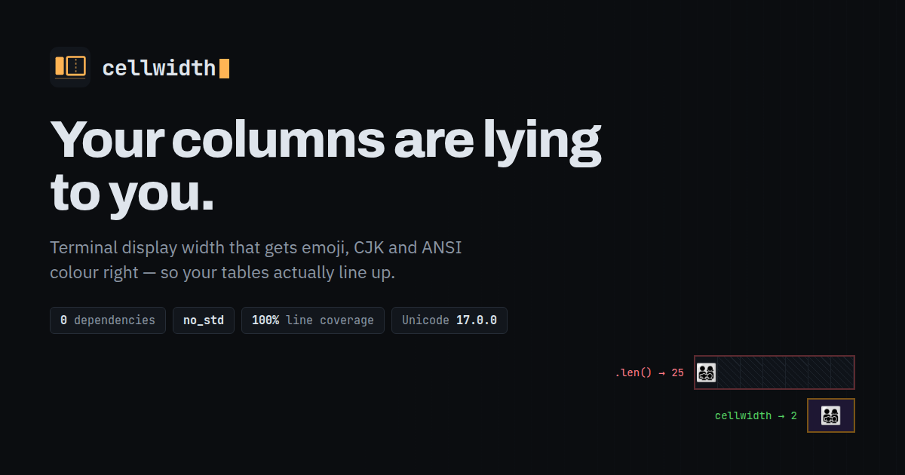

<p align="center">
  <a href="https://singhpratech.github.io/cellwidth/">
    
  </a>
</p>

# cellwidth

[](https://github.com/singhpratech/cellwidth/actions/workflows/ci.yml)
[](https://crates.io/crates/cellwidth)
[](https://docs.rs/cellwidth)
[](https://crates.io/crates/cellwidth)
[](https://github.com/singhpratech/cellwidth/blob/main/Cargo.toml)
[](https://github.com/singhpratech/cellwidth#feature-flags)
[](https://github.com/singhpratech/cellwidth)
[](#license)

Terminal display width that gets emoji, CJK and ANSI colour right.

```rust
use cellwidth::{width, cell, truncate};

assert_eq!(width("café"), 4);               // combining accents don't count
assert_eq!(width("日本語"), 6);              // CJK is double-width
assert_eq!(width("👨‍👩‍👧‍👦"), 2);                 // one glyph, not seven
assert_eq!(width("\x1b[31mred\x1b[0m"), 3); // colour codes are free

assert_eq!(truncate("日本語テキスト", 7), "日本語");  // never splits a character
assert_eq!(width(&cell("🇯🇵 Tōkyō 東京", 10)), 10);  // exactly 10 columns. always.
```

**No dependencies. No build script. `no_std`. MSRV 1.75.**

## The problem

`"👨‍👩‍👧‍👦".len()` is 25. `"👨‍👩‍👧‍👦".chars().count()` is 7. A terminal draws it in **2**
columns.

Every CLI table, progress bar, box border, status line and log formatter needs
that third number. Reach for `len()` or `chars().count()` and your output goes
ragged the first time a user has an umlaut in their name, a Japanese hostname,
or an emoji in a commit message — and it stays broken, because the failure only
shows up on other people's data.

```
$ cargo run --example table
┌────────────────────┬────────────────────────┬────────────┐
│ host               │ label                  │ status     │
├────────────────────┼────────────────────────┼────────────┤
│ nagoya-prod-01     │ 日本語ログ出力         │ healthy    │
│ crew-alpha         │ 👨‍👩‍👧‍👦 shared account      │ healthy    │
│ tokyo-cdn          │ 🇯🇵 Tōkyō 東京 edge     │ offline    │
│ long-name-that-wi… │ café au lait           │ degraded   │
└────────────────────┴────────────────────────┴────────────┘
```

## What it does

| | |
|---|---|
| `width(s)` | columns `s` occupies |
| `truncate(s, n)` | longest prefix fitting `n` columns — borrowed, no allocation |
| `cell(s, n)` | exactly `n` columns: truncate with `…` or pad with spaces |
| `pad_start` / `pad_end` / `center` | align to a column count |
| `wrap(s, n)` | break into lines of at most `n` columns, at UAX #14 opportunities |
| `line_breaks(s)` | where a line may be broken (UAX #14) |
| `Table` | a grid that lines up: sizing, alignment, borders, wrapping cells |
| `graphemes(s)` | iterate user-perceived characters (UAX #29) |
| `strip_ansi(s)` / `pieces(s)` | separate text from escape sequences |

Every operation works in whole grapheme clusters and whole escape sequences, so
a cut never produces half a character or half a colour code.

## Install

```sh
cargo add cellwidth
```

That is the whole dependency graph. `cargo tree` prints one node.

Without this crate, the same job usually takes four:
`unicode-width` for widths, `unicode-segmentation` for clusters,
`strip-ansi-escapes` for colour, `textwrap` for wrapping — plus the glue between
them, which is where the bugs live, because width and segmentation are different
questions and those two crates do not talk to each other.

## Use cases

Every output below is copied from a real run, not typed by hand.

### Columns that line up

The original problem. A width-aware `Table` keeps every row the same number of
cells no matter what the data holds:

```rust
use cellwidth::{Align, Border, Sizing, Table};

let out = Table::new()
    .column("host")
    .column_with("label", Align::Left, Sizing::Max(22))
    .column_aligned("rps", Align::Right)
    .row(["tokyo-cdn", "🇯🇵 Tōkyō 東京 edge", "17,900"])
    .row(["crew-alpha", "👨‍👩‍👧‍👦 shared account", "3"])
    .border(Border::Ascii)
    .render(Some(60));
```

```
+------------+--------------------+--------+
| host       | label              |    rps |
+------------+--------------------+--------+
| tokyo-cdn  | 🇯🇵 Tōkyō 東京 edge | 17,900 |
| crew-alpha | 👨‍👩‍👧‍👦 shared account  |      3 |
+------------+--------------------+--------+
```

A flag, a ZWJ family, CJK and a macron in the same column — and all six lines
measure **44 columns exactly**. That invariant is what the fuzzer asserts.

### Status lines and progress bars that don't smear

Redrawing with `\r` only works if every frame is the *same* width. One frame
narrower than the last and the tail of the previous frame stays on screen.
`cell` guarantees the width:

```rust
use cellwidth::cell;

for (name, pct) in [("building 日本語", 40), ("linking 👨‍👩‍👧‍👦", 95)] {
    print!("\r{} {pct:>3}%", cell(name, 20));
}
```

```
|building 日本語     |  40%
|linking 👨‍👩‍👧‍👦          |  95%
```

Both left fields are 20 columns, though one is 14 chars and the other 8.

### Truncating a coloured log line

`truncate` counts only what is drawn, and never cuts inside an escape sequence
or a character:

```rust
use cellwidth::truncate;

let line = "\x1b[33mWARN\x1b[0m 東京 node unreachable";
assert_eq!(truncate(line, 12), "\x1b[33mWARN\x1b[0m 東京 no");
```

The colour codes cost 0 columns, `東京` costs 4, and the result is 12 visible
columns — it will not split `京` in half or strand a half-written `\x1b[`.

### Wrapping messages to the terminal

`wrap` breaks at real UAX #14 opportunities, so it works in scripts that have no
spaces at all:

```rust
use cellwidth::wrap;

let msg = "認証に失敗しました: the token for 👨‍👩‍👧‍👦 crew-alpha expired";
for line in wrap(msg, 28) {
    println!("{line}");
}
```

```
認証に失敗しました: the
token for 👨‍👩‍👧‍👦 crew-alpha
expired
```

The Japanese clause breaks between characters (no spaces exist to break on), the
English breaks at spaces, and the emoji family is never split.

### Centring a banner

```rust
use cellwidth::Width;

let banner = Width::DEFAULT.center(" 東京 deploy ", 40);
```

```
|              東京 deploy               |
```

### Counting what a user calls a character

```rust
use cellwidth::graphemes;

let g: Vec<&str> = graphemes("👨‍👩‍👧‍👦é日").collect();
assert_eq!(g.len(), 3);   // not 8 chars, not 18 bytes
```

Useful for cursor movement, backspace handling and character limits in a text
input, where deleting one `char` would dismantle an emoji into its parts.

### Where this shows up

Anything that draws a fixed grid into a terminal: CLI tables and reports,
TUI list and column views, progress bars and spinners, log formatters and
column-aligned output, box-drawn banners, help and error text wrapped to
`$COLUMNS`, and text inputs that need cursor and delete to move by characters
rather than bytes.

`no_std` means it also works in a serial console or an embedded shell with no
allocator, where `width`, `truncate`, `graphemes` and `pieces` still function.

## Why the numbers are right

- **Widths** come from the East Asian Width property of the Unicode Character
  Database **17.0.0**, generated into a two-level lookup table.
- **Segmentation** implements UAX #29 extended grapheme clusters, and passes all
  **766 cases** of the official `GraphemeBreakTest.txt` — including emoji ZWJ
  sequences, regional-indicator flags, skin tone modifiers, Hangul syllables and
  Indic conjuncts (GB9c).
- **Variation selectors** are honoured: `❤` is 1 column, `❤️` is 2.
- **Escape sequences** are parsed as sequences (CSI, OSC, DCS, the `nF` forms and
  the 8-bit C1 equivalents), not pattern-matched. OSC 8 hyperlinks measure their
  label, not their URL.
- **Line breaking** implements UAX #14 and passes all **19,338 cases** of
  Unicode's `LineBreakTest.txt`.
- Every code point was **diffed against glibc's `wcwidth`**. The 178 remaining
  disagreements are deliberate and pinned in `tests/width.rs`.
- Segmentation is checked against **`unicode-segmentation`** across 9,282,875
  generated strings, with exact agreement, and widths against
  **`unicode-width`** across all 1,112,064 code points, where every divergence
  is sorted into a bucket with a written reason.
- **33.7 million fuzz executions** across six targets, no crashes.

Eight real defects were found this way, none of them by re-reading the code.
Each has a regression test naming the oracle that caught it.

## Policy, where there is no single right answer

Some questions genuinely cannot be answered from the text alone. Those are
configuration, not guesswork:

```rust
use cellwidth::{Ambiguous, Control, Width};

const CJK: Width = Width::DEFAULT
    .ambiguous(Ambiguous::Wide)   // ± ° § are 2 columns in CJK fonts
    .tab_stop(4)
    .control(Control::Caret);     // count control chars as ^C

assert_eq!(Width::DEFAULT.of("±"), 1);
assert_eq!(CJK.of("±"), 2);
```

The free functions use `Width::DEFAULT`, which is right for a Western locale on
a modern terminal.

## Which terminal are you targeting?

Terminals genuinely disagree about emoji and combining marks, so this was
measured rather than guessed. `probe/` prints a string into a live terminal,
asks where the cursor ended up with `CSI 6n`, and writes down the answer. Four
terminals, 32 cases, recorded in `tests/data/terminals/`:

| | ZWJ family 👨‍👩‍👧‍👦 | ❤ + VS16 | skin tone | Bengali কা |
|---|---|---|---|---|
| **kitty** 0.48 | 2 | 2 | 2 | 1 |
| **WezTerm** 20240203 | 2 | 1 | 2 | 1 |
| **VTE** 0.76 (GNOME Terminal, Tilix, Terminator) | 8 | 1 | 4 | 2 |
| **Alacritty** 0.17 | 8 | 1 | 4 | 1 |

They fall into two camps, so there are two presets:

```rust
Width::DEFAULT   // == Width::MODERN. Every grapheme cluster is one glyph.
Width::LEGACY    // Every code point counts on its own, as wcwidth does.
```

`Width::DEFAULT` reproduces kitty **exactly**, on all 32 cases. `Width::LEGACY`
scores higher across the four terminals as a group (99/128 against 94/128),
because two of the four are in that camp — if you know your users are on GNOME
Terminal or Alacritty, use it.

Everyday text measures the same under both. The choice only matters for emoji
sequences and combining marks.

If you want the terminal to answer for itself, `cargo run -p cellwidth-probe
--bin detect` does the same query at runtime and names the preset to use; it is
about forty lines you can copy into your own startup path.

Reproduce the whole matrix with `probe/drivers/run_all.sh`. Terminals run
headlessly under Xvfb, so it works over ssh.

## Performance

One table lookup per code point; no allocation on the measuring path.

```
width()  ascii             51 ns  1267 MB/s
         cjk              407 ns   279 MB/s
         emoji            580 ns   185 MB/s
         ansi             138 ns   532 MB/s
         table row        250 ns   248 MB/s
truncate() on a table row 192 ns   (no allocation)
cell()     on a table row 588 ns   (one allocation)
```

Best of five runs. `cargo run --release --example bench`

## Limitations, honestly

- **Terminals disagree with each other.** Where they do, this crate follows the
  current UCD and the most common modern rendering. `Width` exists so you can
  choose differently.
- **Complex Indic and Arabic shaping** is measured per spacing character. A
  terminal that shapes `क्षि` into fewer cells will disagree; there is no property
  in Unicode that predicts this.
- **Tabs make width position-dependent.** `width` assumes column 0; use
  `Width::of_at` when a string starts somewhere else. A table cell cannot know
  where it will be drawn, so `Table` expands tabs to spaces.

## Feature flags

| Feature | Default | Effect |
|---|---|---|
| `std` | yes | implies `alloc` |
| `alloc` | via `std` | `cell`, `pad_*`, `wrap`, `strip_ansi` and the other owned-string APIs |

With neither, `width`, `truncate`, `graphemes` and `pieces` still work with no
allocator at all.

## Regenerating the Unicode tables

`src/tables.rs` is generated and committed, which is why there is no build
script and no dependency on a Unicode crate. To move to a new Unicode release:

```sh
mkdir ucd && cd ucd
base=https://www.unicode.org/Public/UCD/latest/ucd
curl -O $base/EastAsianWidth.txt -O $base/UnicodeData.txt \
     -O $base/DerivedCoreProperties.txt \
     -O $base/auxiliary/GraphemeBreakProperty.txt \
     -O $base/emoji/emoji-data.txt
curl -o ../tests/data/GraphemeBreakTest.txt $base/auxiliary/GraphemeBreakTest.txt
cd .. && python3 tools/gen_tables.py ucd > src/tables.rs && cargo test
```

## Tables

```rust
use cellwidth::{Align, Border, Sizing, Table};

let out = Table::new()
    .column("host")
    .column_with("label", Align::Left, Sizing::Max(22))
    .column_aligned("rps", Align::Right)
    .row(["tokyo-cdn", "🇯🇵 Tōkyō 東京 edge", "17,900"])
    .row(["crew-alpha", "👨‍👩‍👧‍👦 shared account", "3"])
    .border(Border::Ascii)
    .render(Some(60));   // squeezed to 60 columns: cells wrap, nothing is lost
```

Column sizing is `Auto`, `Fixed(n)` or `Max(n)`; borders are `Light`, `Heavy`,
`Ascii`, `Markdown` or `None`. Every line of the output is the same number of
terminal columns wide — that is what the fuzzer checks, whatever the cells hold.

## Testing

```sh
cargo test                                     # the crate's own suite, offline
cargo test --manifest-path oracles/Cargo.toml  # differential vs other crates
cargo +nightly miri test -p cellwidth          # 50 tests under the interpreter
cargo llvm-cov -p cellwidth --all-features \
  --ignore-filename-regex 'tables\.rs' --fail-under-lines 100
cd fuzz && cargo +nightly fuzz run cell
```

| | |
|---|---|
| Tests | 89 standalone, 93 with oracles |
| Conformance | 766 UAX #29 + 19,338 UAX #14 + 3,944 emoji sequences |
| Line coverage | 100% (1,239 / 1,239), gated in CI |
| Function coverage | 100% (110 / 110), gated in CI |
| Region coverage | 99.95% — a merge artifact, see CONTRIBUTING |
| Fuzzing | 6 targets, 0 crashes |
| Miri | clean |

The oracle crates live in a separate package (`oracles/`) so this crate has **no
dependencies and no dev-dependencies**. `cargo tree --edges normal,dev` lists
nothing but `cellwidth`, its `Cargo.lock` contains exactly one entry, and CI
runs `cargo test --offline --locked` to keep that true.

CI runs thirteen jobs on every push: the suite on stable, beta and nightly; all
three feature combinations; a bare-metal `thumbv7em-none-eabi` build to prove
`no_std`; MSRV 1.75; the differential oracles; fmt, clippy and rustdoc with
warnings denied; Miri; coverage gated at 100% lines; a 60-second fuzz smoke run
per target; `cargo-semver-checks` against the base branch; and a publish dry
run. A weekly job fails when Unicode publishes a version newer than the tables.

## License

MIT or Apache-2.0, at your option.
